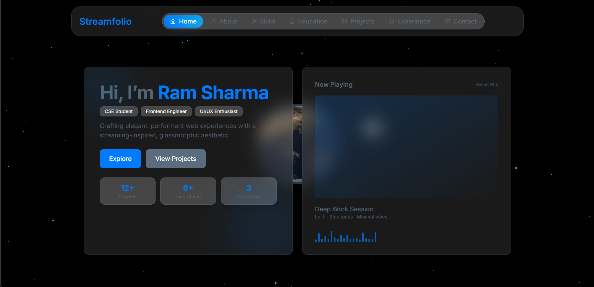
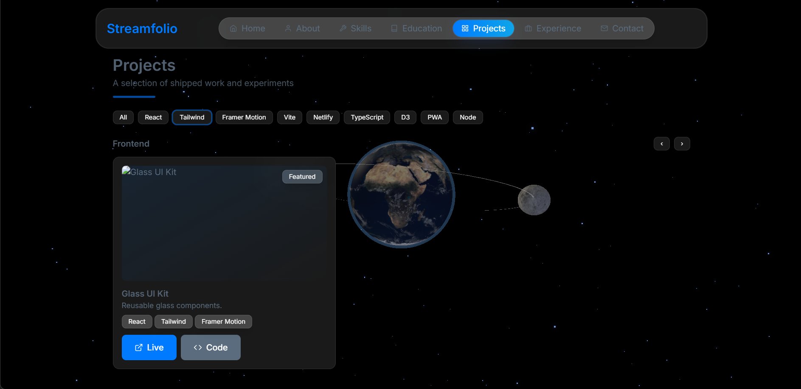
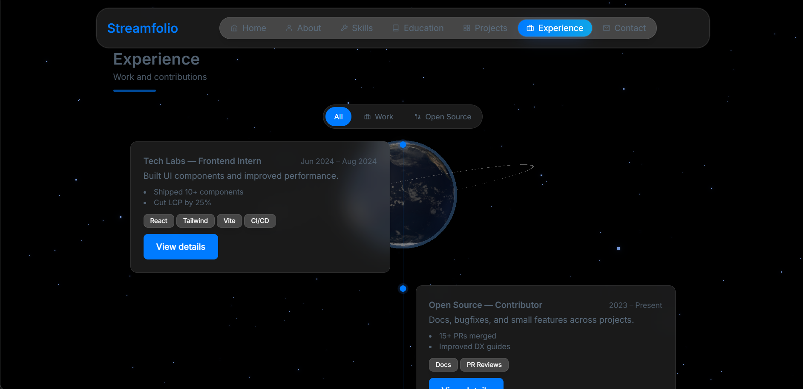

# Streamfolio

Minimal, dark-only portfolio template inspired by streaming UIs. Built with Vite + React, Tailwind CSS, Framer Motion, and a lifelike 3D Earth + Moon background.

Live demo: https://space-stream-portfolio.netlify.app/

## Features
- Fixed, interactive 3D background (Earth + Moon, stars, bloom)
- Glassmorphism UI with soft shadows and accent rings
- Segmented navbar with animated active pill and scroll spy
- Sections: Hero, About, Education, Skills, Projects, Experience, Contact, Footer
- Contact as interactive cards (no message form)
- Netlify-ready SPA redirects

## Tech Stack
- Vite + React 18
- Tailwind CSS (class-based dark mode)
- Framer Motion
- three.js + react-three-fiber + postprocessing

## Screenshots
These screenshots reflect the current look-and-feel.

## Getting Started
1) Install dependencies
	npm install
2) Start dev server
	npm run dev
3) Build
	npm run build
4) Preview build
	npm run preview

## Customize
- Update content in components under `src/components` (e.g., `About.jsx`, `Education.jsx`, `Projects.jsx`, `Experience.jsx`, `Contact.jsx`).
- Replace the favicon at `public/favicon.svg`.
- Colors and fonts are configured in `tailwind.config.js` and `src/index.css`.
- The 3D background lives in `src/components/FixedBackground.jsx`.

## Deploy to Netlify
- Build command: `npm run build`
- Publish directory: `dist`
- `_redirects` in `public/` enables SPA routing

## License
This template is provided as-is. Feel free to fork and adapt for your portfolio.
